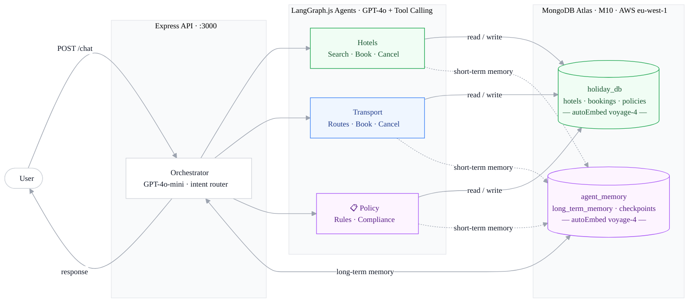

# Agentic AI Holiday Planning Assistant

A multi-agent AI system built with **LangGraph.js**, **MongoDB Atlas**, and **Atlas Auto-Embedding** (voyage-4).  
An orchestrator classifies every incoming query and delegates it to one of three specialist agents — Hotels, Transport, or Policy — each with their own tools and per-user long-term memory.

<p>
  
  
  
  
  
  
</p>

---

## Architecture



### Memory Strategy

| Layer | Mechanism | Scope | Privacy |
|-------|-----------|-------|---------|
| **Short-term** | `MongoDBSaver` (checkpointer) | Per thread | One thread = one conversation |
| **Long-term** | `MongoDBStore` | Per user | Preferences, past trips, compliance flags |

---

## Project Structure

```
.
├── index.ts                      # Express entry point
├── orchestrator.ts               # Intent classifier + agent router
├── seed-database.ts              # Seed script: hotels + travel policies
├── agents/
│   ├── hotels-agent.ts           # Hotels specialist (search, pricing, booking)
│   ├── transport-agent.ts        # Transport specialist (A→B journey planning)
│   └── policy-agent.ts           # Policy & compliance checker
├── memory/
│   ├── store.ts                  # MongoDBStore + MongoDBSaver setup
│   └── memory-api.ts             # Long-term memory CRUD helpers
├── mcp-server/
│   └── index.ts                  # JSON-RPC 2.0 MCP server (stdio)
├── shared/
│   └── utils.ts                  # Constants, types, vectorSearch helper
├── frontend/
│   ├── index.html                # Simple chat UI
│   └── diagram.html              # Architecture diagram
└── terraform/                    # Atlas cluster, users, vector search indexes
```

---

## Prerequisites

| Requirement | Notes |
|-------------|-------|
| Node.js ≥ 20 | `node --version` |
| `ts-node` | Installed via `npm install` |
| MongoDB Atlas account | Free tier is not sufficient — M10 required for Vector Search |
| OpenAI API key | GPT-4o + GPT-4o-mini |
| Terraform ≥ 1.5 | For automated infrastructure setup |

---

## Quick Start

### 1 — Clone and install

```bash
npm install
```

### 2 — Create `.env`

```bash
MONGODB_URI=mongodb+srv://<user>:<password>@holiday-ai-assistant.<host>.mongodb.net/?retryWrites=true&w=majority
OPENAI_API_KEY=sk-...
```

### 3 — Provision infrastructure (Terraform)

```bash
cd terraform
cp terraform.tfvars.example terraform.tfvars
# edit terraform.tfvars – fill in atlas_project_id, public_key, private_key, db_password, openai_api_key
terraform init
terraform apply
```

Terraform will:
1. Provision an M10 Atlas cluster (`holiday-ai-assistant`)
2. Create database user with `readWrite` on `holiday_db` + `agent_memory`
3. Seed `holiday_db.hotels` (20 records) and `holiday_db.travel_policies` (8 documents)
4. Create all three Vector Search indexes with autoEmbed (voyage-4)

### 4 — Start the server

```bash
npm start
```

---

## Seeded Data

Running `npm run seed` (or via Terraform) inserts:

- **20 synthetic hotel records** in `holiday_db.hotels`
  - European destinations: Barcelona, Paris, Santorini, Algarve, Amalfi Coast, Scottish Highlands, Côte d'Azur, Dubrovnik, Mallorca, Amsterdam
  - Property types: hotel, resort, boutique_hotel, villa, apartment, hostel
  - Each record has room types with nightly prices, amenities, star ratings, availability calendar

- **8 travel policy documents** in `holiday_db.travel_policies`
  - Categories: booking, cancellation, payment, child_policy, pet_policy, accessibility, data_protection, travel_insurance

---

## Vector Search Indexes

Three indexes are created by Terraform using **Atlas autoEmbed** (voyage-4 model).  
No Voyage AI API key is needed — Atlas handles embedding server-side.

### Hotels index (`holiday_db.hotels`, name: `hotels_vector_index`)

```json
[
  {
    "type": "autoEmbed",
    "modality": "text",
    "path": "pageContent",
    "model": "voyage-4"
  },
  { "type": "filter", "path": "metadata.city" },
  { "type": "filter", "path": "metadata.country" },
  { "type": "filter", "path": "metadata.star_rating" },
  { "type": "filter", "path": "metadata.property_type" },
  { "type": "filter", "path": "metadata.room_types.currency" }
]
```

### Policies index (`holiday_db.travel_policies`, name: `policy_vector_index`)

```json
[
  {
    "type": "autoEmbed",
    "modality": "text",
    "path": "pageContent",
    "model": "voyage-4"
  },
  { "type": "filter", "path": "metadata.category" },
  { "type": "filter", "path": "metadata.version" }
]
```

### Memory index (`agent_memory.long_term_memory`, name: `memory_vector_index`)

```json
[
  {
    "type": "autoEmbed",
    "modality": "text",
    "path": "value.content",
    "model": "voyage-4"
  },
  { "type": "filter", "path": "namespace" }
]
```

---

## API

### `POST /chat`

```bash
curl -X POST http://localhost:3000/chat \
  -H "Content-Type: application/json" \
  -d '{"userId": "alice", "message": "Find me a 4-star hotel in Barcelona under £150/night"}'
```

### `POST /chat/:threadId`

Continue an existing conversation:

```bash
curl -X POST http://localhost:3000/chat/thread_abc123 \
  -H "Content-Type: application/json" \
  -d '{"userId": "alice", "message": "Book the Barceló Hotel for 5 nights from 15 July"}'
```

### `GET /health`

```bash
curl http://localhost:3000/health
```

---

## Example Queries

### Hotels Agent

| Query | Action |
|-------|--------|
| `"Find me a beach resort in Mallorca"` | Vector search → ranked results |
| `"What rooms does the Hilton Barcelona have?"` | Room availability + price per night |
| `"Book a Superior Double at Grand Hotel Paris, 10–15 Aug, guest: Alice Smith"` | Creates booking, returns booking ref |
| `"Cancel booking BK7X2P9A"` | Updates status to CANCELLED |
| `"What hotels are available in Santorini in September?"` | Availability search |

### Transport Agent

| Query | Action |
|-------|--------|
| `"How do I get from London to Barcelona?"` | Lists flights, trains, coaches, ferries |
| `"What's the cheapest way to travel from Paris to Amsterdam?"` | LLM-powered route research |
| `"How do I get from Barcelona Airport to the city centre?"` | Local transfer advice |
| `"Book an Easyjet flight LGW→BCN on 10 Aug for Alice Smith"` | Creates transport booking |
| `"Cancel my transport booking TR4K8M2Q"` | Updates status to CANCELLED |

### Policy Agent

| Query | Action |
|-------|--------|
| `"What is the cancellation policy?"` | Vector search on travel_policies |
| `"Can I bring my dog to the resort?"` | Looks up pet_policy category |
| `"Is booking BK7X2P9A compliant with child policy?"` | Compliance check |
| `"What are the cancellation terms for my booking TR4K8M2Q?"` | Calculates refund based on days until departure |

---

## MongoDB Data Layout

| Database | Collection | Contents |
|----------|------------|----------|
| `holiday_db` | `hotels` | Accommodation records with room types, pricing, amenities |
| `holiday_db` | `bookings` | All bookings — hotel (`booking_type: "hotel"`) and transport (`booking_type: "transport"`) |
| `holiday_db` | `travel_policies` | Policy documents by category |
| `agent_memory` | `long_term_memory` | Per-user memories (MongoDBStore) |
| `agent_memory` | `checkpoints` | Short-term conversation state (MongoDBSaver) |
| `agent_memory` | `checkpoint_writes` | LangGraph checkpoint writes |

### autoEmbed fields

| Collection | Embedded path | Model |
|------------|--------------|-------|
| `holiday_db.hotels` | `pageContent` | voyage-4 |
| `holiday_db.travel_policies` | `pageContent` | voyage-4 |
| `agent_memory.long_term_memory` | `value.content` | voyage-4 |

---

## Viewing Data in MongoDB Compass

Connect with the URI from your `.env` file.

The user has `readWrite` access on `holiday_db` and `agent_memory` only. To get the exact connection string at any time run:

```bash
cd terraform && terraform output mongodb_connection_string
```

Useful Compass views:
- `holiday_db` → `hotels` — browse seeded accommodation data
- `holiday_db` → `bookings` — all hotel + transport bookings
- `holiday_db` → `travel_policies` — policy documents
- `agent_memory` → `long_term_memory` — per-user memories
- `agent_memory` → `checkpoints` — short-term conversation threads

---

## MCP Server

The `mcp-server/` directory contains a **Model Context Protocol** server that exposes holiday data as MCP tools for use in AI clients (e.g. Claude Desktop, VS Code Copilot).

### Available MCP Tools

| Tool | Description |
|------|-------------|
| `search_hotels` | Semantic search for accommodation matching a text query |
| `get_hotels_by_destination` | List all hotels in a city/country with pricing |
| `get_hotel_details` | Full details for a specific hotel by name |
| `get_booking` | Retrieve a booking by its reference code |
| `get_destination_price_stats` | Average/min/max nightly price stats per destination |

### Running the MCP server

```bash
npx ts-node --project tsconfig.ts-node.json mcp-server/index.ts
```

Or add to your MCP client config:

```json
{
  "mcpServers": {
    "holiday-assistant": {
      "command": "npx",
      "args": ["ts-node", "--project", "tsconfig.ts-node.json", "mcp-server/index.ts"],
      "cwd": "/path/to/this/repo",
      "env": {
        "MONGODB_URI": "mongodb+srv://..."
      }
    }
  }
}
```

---

## Terraform Resources

| Resource | Description |
|----------|-------------|
| `mongodbatlas_advanced_cluster.main` | M10 replica set, MongoDB 8.0, AWS EU_WEST_1 |
| `mongodbatlas_database_user.app` | SCRAM user with `readWrite` on `holiday_db` + `agent_memory` |
| `mongodbatlas_project_ip_access_list.allowed` | IP allowlist (your current IP + Terraform runner) |
| `mongodbatlas_search_index.fares_vector` | `hotels_vector_index` on `holiday_db.hotels` |
| `mongodbatlas_search_index.policies_vector` | `policy_vector_index` on `holiday_db.travel_policies` |
| `mongodbatlas_search_index.memory_vector` | `memory_vector_index` on `agent_memory.long_term_memory` |
| `null_resource.seed_database` | Runs `npm run seed` after cluster + user are ready |
| `null_resource.ttl_indexes` | Creates 30-day TTL indexes on checkpoint collections |

---

## Environment Variables

| Variable | Required | Description |
|----------|----------|-------------|
| `MONGODB_URI` | Yes | Atlas connection string (from Terraform output) |
| `OPENAI_API_KEY` | Yes | OpenAI API key (GPT-4o + GPT-4o-mini) |
| `PORT` | No | HTTP server port (default: 3000) |
